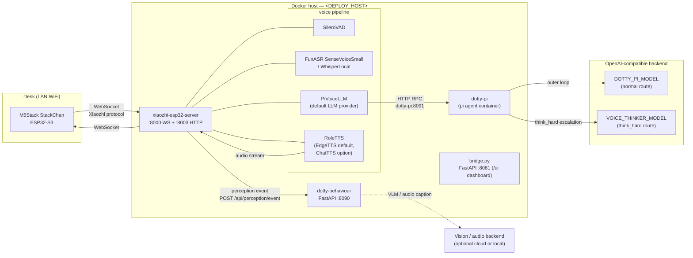
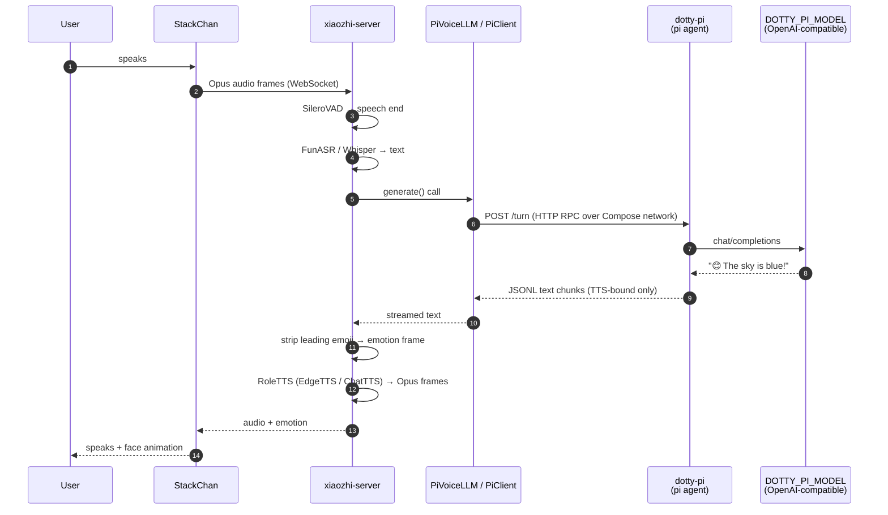
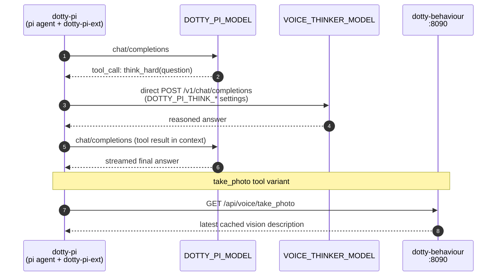
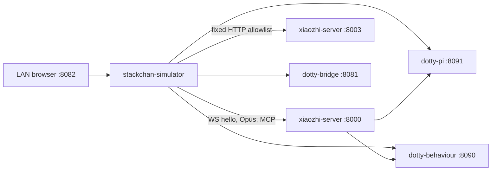

# Architecture

## TL;DR

- Two hosts: **robot** (StackChan on your desk) and a **single Docker host** (`<DEPLOY_HOST>`) that runs all four server-side services.
- Audio goes robot → xiaozhi-server → (text) → dotty-pi → (response text) → xiaozhi-server → (audio) → robot. The Docker host never sends audio to the robot — xiaozhi-server handles that.
- The default voice provider is **`PiVoiceLLM`**, selected via `selected_module.LLM` in `.config.yaml`. One documented alternate exists (`OpenAICompat`) — see [llm-backends.md](./llm-backends.md).
- Everything is LAN-local except configured cloud model calls. The default model route uses a sub2api-compatible endpoint; the optional Ollama profile keeps the normal and `think_hard` routes local. The default EdgeTTS voice is cloud; ChatTTS and Piper are local alternatives.
- The robot speaks the **Xiaozhi WebSocket protocol** (see [protocols.md](./protocols.md)). It has no knowledge of the services running on the Docker host.

> **Cutover note (2026-05-19, issue #36):** The stack previously ran on three hosts — a separate ZeroClaw host (Raspberry Pi) ran the ZeroClaw Rust agent + a FastAPI bridge under systemd. That host has been retired. The brain is now the `dotty-pi` container; the voice provider is `PiVoiceLLM`. See [cutover-behaviour.md](./cutover-behaviour.md) for the historical runbook.

## Topology



Solid arrows are per-turn data flow; dotted arrows are cloud / conditional. All four server-side services share one Docker host.

## Actors

| Actor | Host | Role | Process |
|---|---|---|---|
| **StackChan** | Desk | Captures audio, plays audio, renders face, runs MCP tools for head/LED/camera | ESP32-S3 firmware built from `m5stack/StackChan` |
| **xiaozhi-esp32-server** | Docker host | VAD → ASR → LLM (proxy) → TTS pipeline, emotion dispatch, OTA, admin surface | Docker container |
| **PiVoiceLLM custom provider** | Docker host (inside xiaozhi container) | Default LLM provider — translates each voice turn into a pi RPC request, streams TTS-bound text back | Python, baked into the image |
| **dotty-pi** | Docker host | The voice-tool brain — pi coding agent with the `dotty-pi-ext` extension; owns the agent loop and tool dispatch | Docker container (`dotty-pi`) |
| **dotty-behaviour** | Docker host | Perception event bus, 11 consumer classes (the running set is config-gated), vision/audio explain endpoints, proactive greeter, calendar context | FastAPI container, port 8090 |
| **bridge.py** | Docker host | Admin dashboard service (`/ui`, port 8081). Voice and perception roles were retired in #36; dashboard port to dotty-behaviour is pending. | FastAPI container, port 8081 |
| **sub2api / OpenAI-compatible backend** | External or LAN | Serves the configurable normal and `think_hard` model IDs | External API, or the optional Ollama Compose profile |
| **Vision/audio backend** | Cloud or LAN | Serves VLM and audio-caption requests used by dotty-behaviour | OpenAI-compatible API |

## Data flow (single utterance, PiVoiceLLM — normal turn)



## Data flow (PiVoiceLLM — tool call inside the agent)

Tool dispatch happens entirely inside the `dotty-pi` container. The pi agent with the `dotty-pi-ext` extension drives the tool loop; xiaozhi-server and PiVoiceLLM see only the final streamed text.



The seven voice tools in `dotty-pi-ext`: `memory_lookup`, `remember`,
`recall_person`, `remember_person`, `think_hard`, `take_photo`, and
`play_song`. See [brain.md](./brain.md) for the full tool catalogue.

## Why this shape

- **Audio lives with xiaozhi-server** because the StackChan firmware already speaks the Xiaozhi WS protocol. xiaozhi-esp32-server is the matching server; any alternative would require reimplementing that protocol.
- **The brain is a peer container on the same Compose network** because co-locating dotty-pi with xiaozhi-server keeps voice-turn latency low and avoids a second host to manage.
- **The seam is a custom xiaozhi LLM provider** (`pi_voice.py`, baked into the image). xiaozhi-server thinks it is calling a local Python LLM class; the class calls the dotty-pi HTTP RPC wrapper. That means the brain can be swapped for anything without changing xiaozhi runtime files.
- **dotty-behaviour is a peer container** rather than code inside xiaozhi-server because perception consumers fire 200-token narrative LLM calls; blocking the xiaozhi event loop with that would spike voice latency. A peer container preserves the operational separation that already worked on the Raspberry Pi.

## What each service sees

**StackChan** knows only:
- An OTA URL (`<XIAOZHI_PUBLIC_OTA_BASE_URL>/xiaozhi/ota/`)
- A WS URL (provided by OTA response as `<XIAOZHI_PUBLIC_WS_BASE_URL>/xiaozhi/v1/`)

It does **not** know about dotty-pi, dotty-behaviour, or any LLM.

**xiaozhi-server** knows:
- Its own device-facing WS + OTA ports
- A handful of pluggable providers selected via `data/.config.yaml` `selected_module:`
- The `DOTTY_PI_URL` environment variable, defaulting to `http://dotty-pi:8091`

It does **not** know model aliases, `brain.db`, or model-provider API keys.

**dotty-pi (pi agent)** knows:
- The OpenAI-compatible endpoint and model aliases rendered into `models.json`
- The `dotty-pi-ext` extension with the seven voice tools
- The Bridge-managed Role/Voice state, the default Role initialization prompt, and the persistent `brain.db`

It does **not** know about the xiaozhi WebSocket protocol or audio.

**dotty-behaviour** knows:
- The xiaozhi admin endpoints (for inject-text, set-head-angles, abort)
- Vision/audio caption API keys (for scene synthesis)

**bridge.py** (dashboard service) knows:
- The xiaozhi admin endpoints (for dashboard relay)
- Its voice and perception routing tables were retired in #36; dashboard port to dotty-behaviour is pending

## Admin surface (two services, two prefixes)

Admin routes are split across two services and reached at different prefixes.

### bridge.py `/admin/*` (Docker host, `DOTTY_BRIDGE_PORT`)

Runtime mode and state mutations for operator scripts. Requests require the
shared `X-Admin-Token` value from `DOTTY_ADMIN_TOKEN`. The dashboard itself
uses `/ui/actions/*` with dashboard auth and CSRF protection. Retired ZeroClaw
persona and source-rewrite endpoints have been removed.

| Endpoint | Effect |
|---|---|
| `POST /admin/kid-mode` `{enabled: bool}` | Persists + hot-reloads kid-mode. Pushes the kid pip via the xiaozhi admin relay. |
| `POST /admin/smart-mode` `{enabled: bool, device_id?}` | Persists + pushes the smart pip. It does not change Role or the PiVoiceLLM model. |
| `POST /admin/state` `{state, device_id?}` | Sets the high-level robot state through the xiaozhi admin relay. |

### xiaozhi-server `/xiaozhi/admin/*` (Docker host, port 8003)

Operations that need to touch a live device session — head servos, MCP dispatch, TTS injection. Exposed by `custom-providers/xiaozhi-patches/http_server.py`.

## Optional simulator profile



The simulator is isolated behind the `simulator` Compose profile. Its backend
owns the device WebSocket, Opus codecs, uploaded test scene, audio samples,
request log, and admin-token injection. The browser only talks to the
simulator's same-origin API and `/ws/ui`; arbitrary proxy targets are not
accepted.

| Endpoint | Purpose |
|---|---|
| `POST /xiaozhi/admin/inject-text` | Speak arbitrary text through TTS as if Dotty originated it. Used by face-greeter and proactive prompts. |
| `GET /xiaozhi/admin/devices` | List connected device-ids. |
| `POST /xiaozhi/admin/abort` | Abort an in-flight TTS turn (used by the face-lost aborter). |
| `POST /xiaozhi/admin/set-head-angles` | Move the head servos (used by sound-direction turn). |
| `POST /xiaozhi/admin/set-state` | Dispatch a `set_state` MCP call to firmware. |
| `POST /xiaozhi/admin/set-toggle` | Dispatch a `set_toggle` MCP call (kid/smart pip on the firmware ring). |
| `POST /xiaozhi/admin/set-face-identified` | Light the face-identified pixel for ~4 s. |
| `POST /xiaozhi/admin/take-photo` | Trigger a camera capture. |
| `GET /xiaozhi/admin/songs` | List audio assets available to `play_song`. |
| `POST /xiaozhi/admin/play-asset` | Play a named audio asset through the speaker. |
| `POST /xiaozhi/admin/say` | Synthesise + play arbitrary text. |

### Perception event bus

Firmware-resident producers emit JSON `event` frames over the xiaozhi WebSocket:

```json
{"type":"event","name":"face_detected","data":{}}
{"type":"event","name":"face_lost","data":{}}
{"type":"event","name":"sound_event","data":{"direction":"left","balance":0.997,"energy":1807933247}}
```

The xiaozhi-server's `EventTextMessageHandler` (`custom-providers/xiaozhi-patches/textMessageHandlerRegistry.py`) POSTs each frame to `dotty-behaviour`'s `POST /api/perception/event`. dotty-behaviour maintains the pub/sub bus (`dotty-behaviour/perception/state.py`) and runs 11 consumer classes against it (`dotty-behaviour/consumers/`); the actually-running set is env-gated at runtime:

| Consumer | What it does |
|---|---|
| `FaceGreeter` | "Hi!" greeting (via `/xiaozhi/admin/inject-text`) on first face detection after a cooldown window. |
| `SoundTurner` | Head-turn (via `/xiaozhi/admin/set-head-angles`) toward sound direction. |
| `FaceLostAborter` | Aborts an in-flight TTS turn (via `/xiaozhi/admin/abort`) when the audience walks away. |
| `WakeWordTurner` | Head-turn toward the speaker on wake-word event. |
| `FaceIdentifiedRefresher` | Re-asserts the face-identified pixel every ~3 s so the firmware's 4 s timeout doesn't drop it. |
| `PurrPlayer` | Plays an idle purr asset when conditions match. |
| `SceneSynthesis` | Ambient vision narrative + audio caption synthesis loop. |
| `IdlePhotographer` | Periodic idle-state camera capture for scene context. |
| `SleepDreamer` | Sleep-state ambient consumer. |
| `DanceReflector` | Reflects dance start/stop events into behaviour. |
| `SecurityCycle` | Security-state surveillance scaffolding (Phase 8 PENDING — not a live capture path). |

WebSocket lifecycle gotcha: xiaozhi only opens the WS during a conversation. Firmware-side perception producers must call `OpenAudioChannel()` first, or events from idle silently drop.

## Threat-model implications

- **Device compromise** gives an attacker a WS session to xiaozhi-server and the ability to invoke any server-exposed MCP tool. It does **not** give them LLM keys or network access to OpenRouter beyond what proxied prompts can achieve.
- **Docker host compromise** gives them access to all four services — xiaozhi-server, dotty-pi (with brain.db and persona files), dotty-behaviour, bridge.py. The `/admin/*` mutation endpoints on bridge.py are `127.0.0.1`-only.
- **OpenRouter compromise** gives log access to every prompt sent via cloud models. Treat prompts as non-confidential.

See [`ROADMAP.md`](ROADMAP.md) for related backlog items (privacy-indicator LEDs, child-safety hardening).

## Deployment files (this repo)

The canonical working copies live in this repo.

| File / Directory | Deployed to | Purpose |
|---|---|---|
| `compose.yml` | Docker host `/mnt/user/appdata/dotty-stackchan-src/` | Single Compose entry for all services |
| `dotty-pi/` | Docker image build context | pi agent container Dockerfile and RPC wrapper |
| `dotty-pi-ext/` | Baked into dotty-pi image | dotty-pi-ext extension |
| `dotty-behaviour/` | Docker image build context | Perception + ambient behaviour container |
| `bridge.py`, `bridge/` | Baked into dotty-bridge image | Admin dashboard FastAPI service and pinned dependencies |
| `custom-providers/pi_voice/` | Baked into xiaozhi image under `core/providers/llm/pi_voice/` | PiVoiceLLM + PiClient |
| `custom-providers/openai_compat/` | Baked into xiaozhi image under `core/providers/llm/openai_compat/` | OpenAICompat alternate provider |
| `custom-providers/edge_stream/` | Baked into xiaozhi image under `core/providers/tts/` | Streaming EdgeTTS provider |
| `custom-providers/piper_local/` | Baked into xiaozhi image under `core/providers/tts/` | Local Piper TTS provider |
| `custom-providers/asr/fun_local.py` | Baked into xiaozhi image under `core/providers/asr/` | Patched FunASR provider (adds `language` config key) |
| `custom-providers/asr/sensevoice_onnx.py` | Baked into xiaozhi image under `core/providers/asr/` | Optional int8 sherpa-onnx SenseVoice provider |
| `custom-providers/xiaozhi-patches/` | Baked into xiaozhi image as drop-in overrides | Admin routes, OTA handling, and serialized firmware MCP commands |
| `.config.yaml` | Docker host `data/.config.yaml` | xiaozhi-server config override |
| `scripts/deploy-stack.sh` | run from admin workstation | Sync repo and deploy the full stack |

Volume mounts (xiaozhi-server) are listed in [quickstart.md](./quickstart.md#deployment-layout).

## See also

- [hardware.md](./hardware.md) — what the robot actually is.
- [voice-pipeline.md](./voice-pipeline.md) — what xiaozhi-server runs.
- [brain.md](./brain.md) — the pi agent, model matrix, and dotty-pi-ext tools.
- [protocols.md](./protocols.md) — what's on the wire (pi RPC mode, `/api/perception/event`).
- [quickstart.md](./quickstart.md) — deployment placeholders, volume mounts, common ops.
- [llm-backends.md](./llm-backends.md) — choosing between PiVoiceLLM and OpenAICompat.

Last verified: 2026-05-22.
