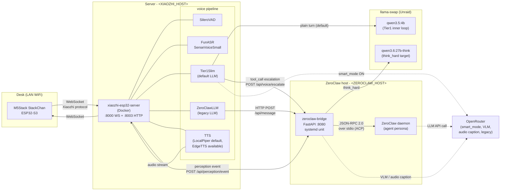
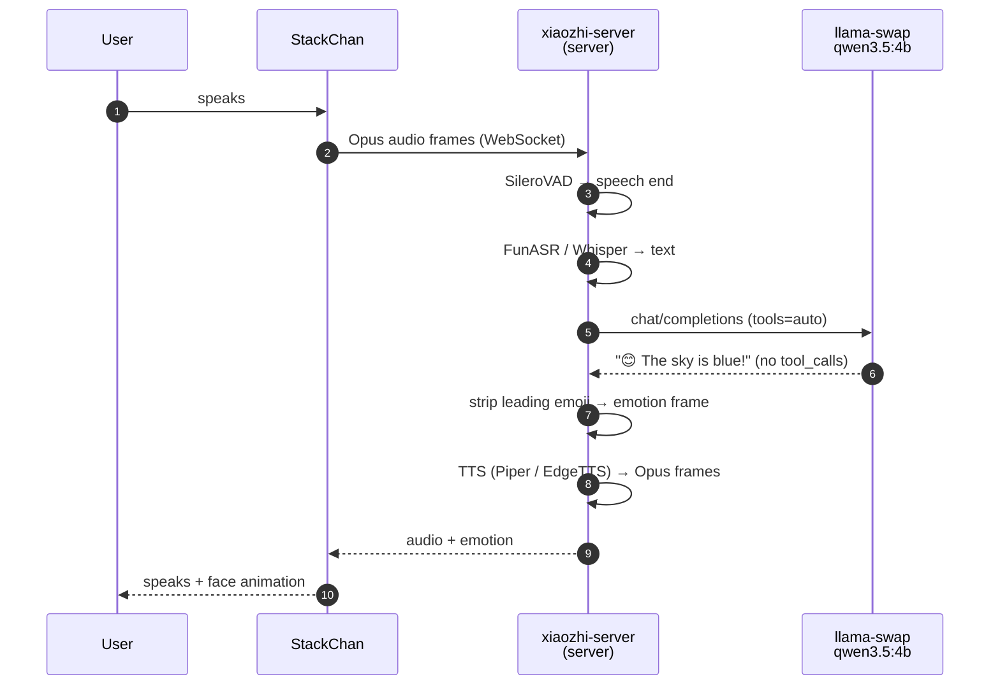
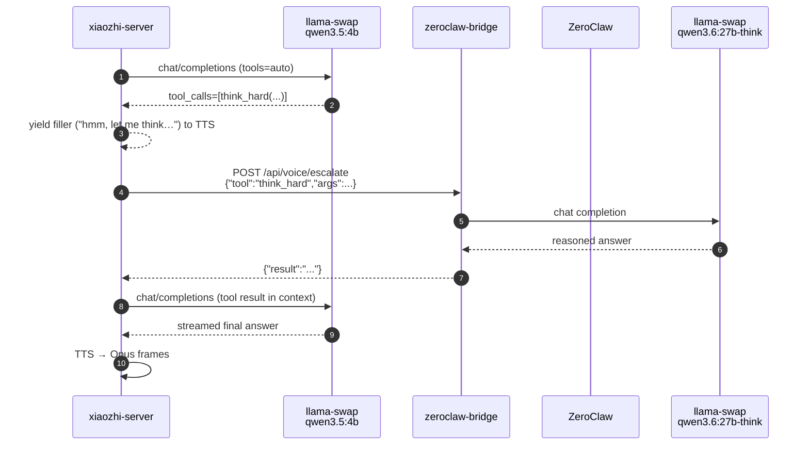
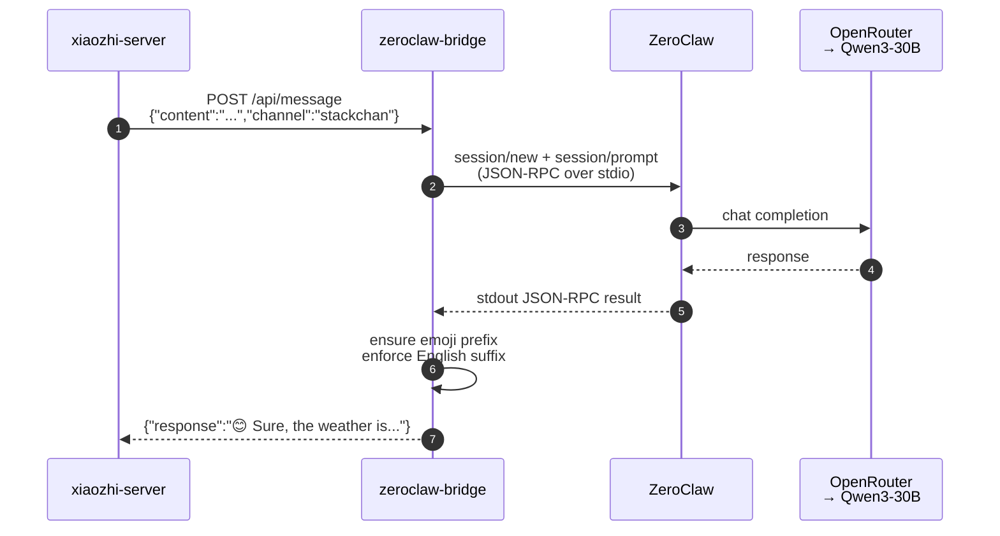

# Architecture

## TL;DR

- Three hosts: **robot** (StackChan on your desk) → **server** (runs xiaozhi-esp32-server) → **ZeroClaw host** (runs ZeroClaw + a FastAPI bridge).
- Audio goes robot → server → (text) → ZeroClaw host → (response text) → server → (audio) → robot. The ZeroClaw host never touches audio.
- **Two voice paths coexist**, selected by `selected_module.LLM` in `.config.yaml`:
  - **`Tier1Slim`** (current default) — a small/fast LLM (`qwen3.5:4b`) handles plain turns directly from xiaozhi-server against a local llama-swap, no bridge round-trip. Tool calls escalate to the bridge via `/api/voice/escalate`.
  - **`ZeroClawLLM`** (legacy single-tier) — every turn goes through the bridge → ZeroClaw → OpenRouter (Qwen3-30B).
- Everything is LAN-local **except** cloud-routed LLM calls (smart-mode, ZeroClawLLM, VLM, audio caption). EdgeTTS is cloud too when selected; Piper is fully local.
- The "xiaozhi ↔ brain" seam is HTTP + ACP-over-stdio, not a library call — either side can be swapped independently.
- The robot speaks the **Xiaozhi WebSocket protocol** (see [protocols.md](./protocols.md)). It has no hardcoded knowledge of ZeroClaw.

## Topology



Solid arrows are per-turn data flow; dotted arrows are cloud / conditional. The two voice paths share the same physical xiaozhi container — only one is active at a time via `selected_module.LLM`.

## Actors

| Actor | Host | Role | Process |
|---|---|---|---|
| **StackChan** | Desk | Captures audio, plays audio, renders face, runs MCP tools for head/LED/camera | ESP32-S3 firmware built from `m5stack/StackChan` |
| **xiaozhi-esp32-server** | Server | VAD → ASR → LLM (proxy) → TTS pipeline, emotion dispatch, OTA, admin surface | Docker container |
| **Tier1Slim custom provider** | Server (inside container) | Default LLM provider — talks directly to llama-swap for plain turns, posts to `/api/voice/escalate` for tool calls | Python, mounted via volume |
| **ZeroClawLLM custom provider** | Server (inside container) | Legacy single-tier LLM provider — translates xiaozhi's LLM-provider interface to an HTTP POST to the bridge | Python, mounted via volume |
| **llama-swap** | Unraid (or any GPU host) | Routes OpenAI-compatible requests to per-model llama-server children; co-loads `qwen3.5:4b` (voice inner loop) and `qwen3.6:27b-think` (`think_hard` target) | Docker container (`ghcr.io/mostlygeek/llama-swap:cuda`) |
| **zeroclaw-bridge** | ZeroClaw host | Accepts HTTP POSTs from both voice paths + xiaozhi-server perception relay; spawns/holds a `zeroclaw acp` child; speaks ACP JSON-RPC to it | FastAPI + uvicorn under systemd |
| **ZeroClaw daemon** | ZeroClaw host | The configured persona — runs the agent loop, calls the LLM, consults `SOUL.md`/`IDENTITY.md`/`MEMORY.md` | Rust binary (`zeroclaw acp`) |
| **OpenRouter** | Cloud | Routes cloud LLM calls (smart_mode `claude-sonnet-4-6`, VLM `gemini-2.0-flash`, audio caption `gemini-2.5-flash`, and the legacy ZeroClaw path's Qwen3-30B) | External |

## Data flow (single utterance, Tier1Slim path — plain turn)



## Data flow (Tier1Slim path — escalated tool call)



## Data flow (legacy ZeroClawLLM path)



See [protocols.md](./protocols.md) for every wire format referenced above, and [tier1slim.md](./tier1slim.md) for the four-tool escalation catalogue.

## Why this shape

- **Audio lives with the server** because the StackChan firmware already speaks the Xiaozhi WS protocol; xiaozhi-esp32-server is the matching server. Putting the brain next to the mic would require us to reimplement that protocol, and we'd still need a voice server.
- **The brain lives with ZeroClaw** because ZeroClaw already has memory, tools, persona, channels, LLM routing wired up. The robot is just another channel into the same agent.
- **A bridge lives between them** because ZeroClaw's HTTP API is observational; to *prompt* a running agent you have to use ACP (JSON-RPC 2.0 over stdio) against a `zeroclaw acp` child. The bridge is a tiny FastAPI adapter that does exactly that.
- **The seam is a custom xiaozhi LLM provider** (`zeroclaw.py`, mounted into the container). xiaozhi-server thinks it's calling a local Python LLM class; the class just does an HTTP POST to `<ZEROCLAW_HOST>:8080/api/message`. That means we could swap ZeroClaw for anything HTTP-serviceable without touching xiaozhi.

## What each host sees

**Robot** knows only:
- An OTA HTTP URL (`http://<XIAOZHI_HOST>:8003/xiaozhi/ota/`)
- A WS URL (provided by OTA response, typically `ws://<XIAOZHI_HOST>:8000/xiaozhi/v1/`)

It does **not** know about the ZeroClaw host, ZeroClaw itself, or any LLM.

**Server / xiaozhi-server** knows:
- Its own device-facing WS + OTA ports
- A handful of pluggable providers selected via `data/.config.yaml` `selected_module:`
- The LLM provider's `base_url: http://<ZEROCLAW_HOST>:8080` to reach the bridge

It does **not** know about ACP, ZeroClaw workspace files, or the OpenRouter key.

**ZeroClaw host / bridge** knows:
- How to `subprocess.Popen("zeroclaw acp")` and speak JSON-RPC 2.0 on stdin/stdout
- How to wrap turns that arrive with `channel="stackchan"` in the English+emoji sandwich
- The OpenRouter API key lives in ZeroClaw's config, not in the bridge

**ZeroClaw** knows everything agent-side — provider keys, memory, tools, persona files. It does **not** know what host/channel the request came from beyond the `channel` string passed in.

## Admin surface (two services, two prefixes)

Admin routes are split across the two services and reached at different prefixes. Don't conflate them.

### Bridge `/admin/*` (ZeroClaw host, `127.0.0.1:8080` only)

Runtime mutations to ZeroClaw / the bridge process itself. Bound to localhost only — LAN callers get `403`.

| Endpoint | Effect | Restart |
|---|---|---|
| `POST /admin/kid-mode` `{enabled: bool}` | Persists + hot-reloads kid-mode via `_apply_kid_mode()` (no daemon restart needed; module globals re-bind atomically). Pushes the kid pip via the xiaozhi admin relay. | none |
| `POST /admin/smart-mode` `{enabled: bool, device_id?}` | Persists + pushes the smart pip. When `DOTTY_VOICE_PROVIDER=tier1slim`: hot-swaps Tier1Slim's model/url/api_key via `/xiaozhi/admin/set-tier1slim-model` (in-process; no restart). When `DOTTY_VOICE_PROVIDER=zeroclaw`: rewrites ZeroClaw's `config.toml` and restarts the voice daemon. | conditional (see above) |
| `POST /admin/persona` `{file, content}` | Overwrites a workspace persona file (`SOUL.md`, `IDENTITY.md`, `USER.md`, `AGENTS.md`, `TOOLS.md`, `BOOTSTRAP.md`, `HEARTBEAT.md`, `MEMORY.md`). Atomic via `.new` + rename. | none |
| `POST /admin/model` `{daemon, model}` | TOML-edits `default_model` in the chosen daemon's `config.toml`. | named daemon |
| `POST /admin/safety` `{action, tool}` | Adds/removes a tool in `MCP_TOOL_ALLOWLIST` via the `# === ADMIN_ALLOWLIST_START/END ===` marker block. py_compile-validated; on syntax error the bridge is left untouched. | bridge (self-restart) |

Paths and systemd unit names are env-configurable (`ZEROCLAW_VOICE_CFG`, `ZEROCLAW_VOICE_UNIT`, `ZEROCLAW_DISCORD_CFG`, `ZEROCLAW_DISCORD_UNIT`, `ZEROCLAW_WORKSPACE`); defaults match the documented ZeroClaw-host layout.

### xiaozhi-server `/xiaozhi/admin/*` (server, port 8003)

Operations that need to touch a live device session — head servos, MCP dispatch, TTS injection, the live LLM provider's runtime config. Exposed by `custom-providers/xiaozhi-patches/http_server.py`. Bound to the xiaozhi container's listen address (not localhost-only); protect with network ACLs if the server is reachable from untrusted networks.

| Endpoint | Purpose |
|---|---|
| `POST /xiaozhi/admin/inject-text` | Speak arbitrary text through TTS as if Dotty originated it. Used by face-greeter and proactive prompts. |
| `GET /xiaozhi/admin/devices` | List connected device-ids. |
| `POST /xiaozhi/admin/abort` | Abort an in-flight TTS turn (used by the face-lost aborter). |
| `POST /xiaozhi/admin/set-head-angles` | Move the head servos (used by sound-direction turn). |
| `POST /xiaozhi/admin/set-state` | Dispatch a `set_state` MCP call to firmware. |
| `POST /xiaozhi/admin/set-toggle` | Dispatch a `set_toggle` MCP call (kid/smart pip on the firmware ring). |
| `POST /xiaozhi/admin/set-face-identified` | Light the face-identified pixel for ~4 s. |
| `POST /xiaozhi/admin/take-photo` | Trigger a camera capture from the bridge (separate from the firmware MCP path). |
| `POST /xiaozhi/admin/set-tier1slim-model` | Hot-swap the live Tier1Slim provider's `model` / `url` / `api_key`. Driven by smart-mode flips. |
| `GET /xiaozhi/admin/songs` | List audio assets available to `play_song`. |
| `POST /xiaozhi/admin/play-asset` | Play a named audio asset through the speaker. |
| `POST /xiaozhi/admin/say` | Synthesise + play arbitrary text (lower-level than `inject-text`). |

### Perception event bus

Firmware-resident producers emit JSON `event` frames over the xiaozhi WebSocket:

```json
{"type":"event","name":"face_detected","data":{}}
{"type":"event","name":"face_lost","data":{}}
{"type":"event","name":"sound_event","data":{"direction":"left","balance":0.997,"energy":1807933247}}
```

The xiaozhi-server's `EventTextMessageHandler` (`custom-providers/xiaozhi-patches/textMessageHandlerRegistry.py`) POSTs each frame to the bridge's `POST /api/perception/event`. The bridge maintains a pub/sub bus (`_perception_listeners`) and per-device state (`_perception_state[device_id]`), and runs six consumer tasks against it:

| Consumer | What it does |
|---|---|
| `_perception_face_greeter` | "Hi!" greeting (via `/xiaozhi/admin/inject-text`) on first face detection after a cooldown window. |
| `_perception_sound_turner` | Head-turn (via `/xiaozhi/admin/set-head-angles`) toward sound direction. |
| `_perception_face_lost_aborter` | Aborts an in-flight TTS turn (via `/xiaozhi/admin/abort`) when the audience walks away. |
| `_perception_wake_word_turner` | Head-turn toward the speaker on wake-word event. |
| `_perception_face_identified_refresher` | Re-asserts the face-identified pixel every ~3 s so the firmware's 4 s timeout doesn't drop it. |
| `_perception_purr_player` | Plays an idle purr asset when conditions match. |

WebSocket lifecycle gotcha: xiaozhi only opens the WS during a conversation. Firmware-side perception producers must call `OpenAudioChannel()` first, or events from idle silently drop.

## Threat-model implications

- **Device compromise** gives an attacker a WS session to xiaozhi-server and the ability to invoke any server-exposed MCP tool. It does **not** give them the LLM key, ZeroClaw's memory, or network access to OpenRouter beyond what proxied prompts can achieve.
- **Server compromise** gives them access to the bridge over HTTP (no auth currently). Anything the bridge can ask ZeroClaw, the attacker can ask it. The `/admin/*` mutation endpoints are unreachable (they're `127.0.0.1`-only).
- **ZeroClaw host compromise** gives them everything — LLM keys, memory DB, workspace persona files.
- **OpenRouter compromise** gives them log access to every prompt sent. Treat prompts as non-confidential.

See [`ROADMAP.md`](ROADMAP.md) for related backlog items (privacy-indicator LEDs, child-safety hardening).

## Deployment files (this repo)

The canonical working copies live in this repo. The deployed copies on each host should match — if they drift, redeploy from here.

| File | Deployed to | Purpose |
|---|---|---|
| `bridge.py` | ZeroClaw host `<BRIDGE_PATH>/bridge.py` | FastAPI HTTP→ZeroClaw translator (ACP over stdio) |
| `bridge/requirements.txt` | bare-metal venv | Pinned Python deps for the bridge (fastapi, uvicorn, pydantic) |
| `zeroclaw-bridge.service` | ZeroClaw host `/etc/systemd/system/` | systemd unit for bridge |
| `custom-providers/zeroclaw/zeroclaw.py` | Server `core/providers/llm/zeroclaw/zeroclaw.py` | xiaozhi LLM provider, proxies to the ZeroClaw bridge |
| `custom-providers/zeroclaw/__init__.py` | Server `core/providers/llm/zeroclaw/__init__.py` | Python package marker |
| `custom-providers/edge_stream/edge_stream.py` | Server `core/providers/tts/edge_stream.py` | Streaming EdgeTTS provider |
| `custom-providers/piper_local/piper_local.py` | Server `core/providers/tts/piper_local.py` | Local Piper TTS provider (offline alternative to EdgeTTS) |
| `custom-providers/asr/fun_local.py` | Server `core/providers/asr/fun_local.py` | Patched FunASR provider (adds `language` config key) |
| `.config.yaml` | Server `data/.config.yaml` | xiaozhi-server config override |
| `.env.example` | reference only | Documented environment variables with defaults |
| `docker-compose.yml` | Server `<XIAOZHI_PATH>` | Container definition |

Volume mounts (server) are listed in [quickstart.md](./quickstart.md#deployment-layout).

## See also

- [hardware.md](./hardware.md) — what the robot actually is.
- [voice-pipeline.md](./voice-pipeline.md) — what the server runs.
- [tier1slim.md](./tier1slim.md) — the default voice LLM and its escalation contract.
- [brain.md](./brain.md) — model matrix + what the ZeroClaw host runs.
- [protocols.md](./protocols.md) — what's on the wire (including `/api/voice/escalate` and `/api/perception/event`).
- [quickstart.md](./quickstart.md) — deployment placeholders, volume mounts, common ops.

Last verified: 2026-05-17.
