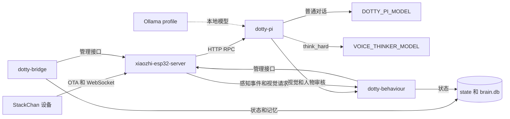
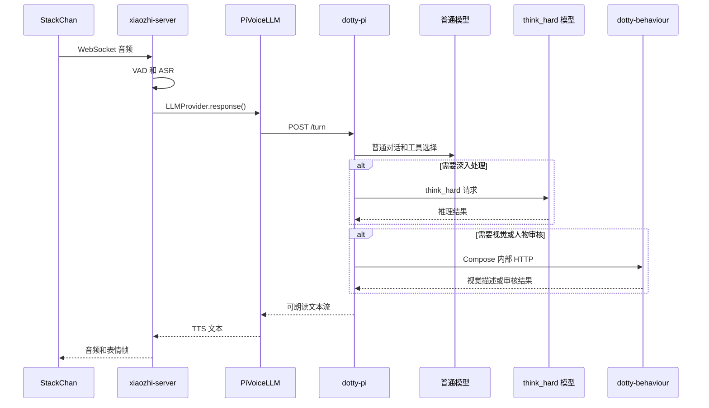

# 部署手册

本文是 Dotty 全栈部署的权威手册。Dockerfile、`compose.yml`、环境变量、模型路由、持久目录或服务调用关系有变动时，必须同步更新本文。

## 整体架构



根目录只有一个 `compose.yml`。四个核心服务共享 Compose 网络，Ollama 作为可选的 `local-llm` profile 定义在同一文件中。容器间调用使用服务名，不经过宿主机端口。

xiaozhi 的自定义 provider、补丁、persona 和内置资源由根 Dockerfile 构建进镜像。`dotty-pi` 的扩展和 persona、`dotty-behaviour` 与 `dotty-bridge` 的应用源码也分别构建进各自镜像。运行时只挂载配置、模型、固件、状态、日志、密钥、记忆和临时目录。三个自有运行时容器使用 Compose `init: true` 处理信号和子进程，Python 健康检查不再额外安装 curl。

`dotty-pi` 使用镜像内 persona 作为 system prompt，并禁用 pi 的内置 shell 和文件工具。语音 agent 只能调用 `dotty-pi-ext` 注册的业务工具。

## 语音调用时序



## 服务和端口

| 服务 | 职责 | 宿主机端口 |
|---|---|---|
| `xiaozhi-esp32-server` | 设备连接、ASR、TTS、OTA | `XIAOZHI_WS_PORT`、`XIAOZHI_HTTP_PORT` |
| `dotty-pi` | pi agent、工具、记忆和模型路由 | `127.0.0.1:DOTTY_PI_RPC_PORT` |
| `dotty-behaviour` | 感知、视觉、主动问候和场景处理 | `DOTTY_BEHAVIOUR_PORT` |
| `dotty-bridge` | 管理台和状态操作 | `DOTTY_BRIDGE_PORT` |
| `ollama` | 可选本地模型服务 | `127.0.0.1:OLLAMA_PORT` |

内部地址固定为：

```text
http://dotty-pi:8091
http://dotty-behaviour:8090
http://xiaozhi-esp32-server:8003
http://ollama:11434
```

`XIAOZHI_WS_PORT` 和 `XIAOZHI_HTTP_PORT` 只控制 Compose 的宿主机端口映射。硬件实际访问的地址由 `XIAOZHI_PUBLIC_WS_BASE_URL` 和 `XIAOZHI_PUBLIC_OTA_BASE_URL` 决定，可以指向不同域名、TLS 网关或不同端口。容器间调用仍使用上面的 Compose DNS 地址。

## 持久目录

默认 Unraid 目录如下：

```text
/mnt/user/appdata/
├── dotty-stackchan-src/
│   ├── .env
│   ├── compose.yml
│   ├── data/
│   ├── models/
│   ├── songs/
│   └── tmp/
├── dotty-pi/
│   ├── agent/
│   ├── memory/
│   └── sessions/
├── dotty-behaviour/
│   ├── state/
│   ├── logs/
│   └── secrets/
└── dotty-bridge/
    ├── state/
    ├── logs/
    └── secrets/
```

远程部署会替换源码文件，但保留 `.env`、`data/`、`models/`、`songs/` 和 `tmp/`。`songs/` 中自行放入的媒体会在构建时进入 xiaozhi 镜像，不会作为运行时源码挂载。

非 Unraid 宿主机应在 `.env` 中设置 `DOTTY_PI_STATE_DIR`、`DOTTY_BEHAVIOUR_STATE_DIR` 和 `DOTTY_BRIDGE_STATE_DIR`，不要依赖默认的 `/mnt/user/appdata/` 路径。

## 宿主机准备

宿主机需要 Docker Engine、Docker Compose v2、Git、Make 和 curl。克隆仓库后进入根目录：

```bash
git clone <DOTTY_REPOSITORY_URL> dotty-stackchan
cd dotty-stackchan
```

固件源码仅在本机构建固件时需要：

```bash
git submodule update --init --recursive
```

## 基础配置

```bash
cp .env.example .env
openssl rand -hex 32
$EDITOR .env
```

至少设置以下内容：

```env
TZ=Australia/Brisbane
XIAOZHI_WS_PORT=8000
XIAOZHI_HTTP_PORT=8003
XIAOZHI_PUBLIC_WS_BASE_URL=ws://192.168.1.10:8000
XIAOZHI_PUBLIC_OTA_BASE_URL=http://192.168.1.10:8003
DOTTY_ADMIN_TOKEN=<上一步生成的随机值>

DOTTY_PI_BASE_URL=https://SUB2API_DOMAIN_PLACEHOLDER/v1
DOTTY_PI_API_KEY=sk-...
DOTTY_PI_PROVIDER=sub2api
DOTTY_PI_MODEL=dotty-simple
DOTTY_PI_SYSTEM_PROMPT_FILE=/opt/dotty-pi/personas/dotty_voice.md
VOICE_THINKER_MODEL=dotty-think

DOTTY_PI_SIMPLE_REASONING=false
DOTTY_PI_SIMPLE_MAX_TOKENS=2048
DOTTY_PI_THINK_REASONING=true
DOTTY_PI_THINK_REASONING_EFFORT=high
DOTTY_PI_THINK_MAX_TOKENS=4096
```

普通对话使用 `DOTTY_PI_MODEL`。`think_hard` 使用 `VOICE_THINKER_MODEL`，并读取同一组 `DOTTY_PI_THINK_*` 参数。`VOICE_THINKER_URL` 留空时，接口地址自动使用 `DOTTY_PI_BASE_URL + /chat/completions`；`VOICE_THINKER_API_KEY` 留空时复用 `DOTTY_PI_API_KEY`。`DOTTY_PI_SYSTEM_PROMPT_FILE` 只能选择镜像内 `/opt/dotty-pi/personas/` 下的文件；修改 persona 源文件后需要重新构建 `dotty-pi`。

bridge 页面右上角的 Configuration 面板可运行时修改普通/深度思考模型、reasoning 开关与 effort，以及设备可见的 WebSocket/OTA 基础地址。`.env` 只提供初始默认值；页面配置原子保存到 `${DOTTY_BRIDGE_STATE_DIR}/state/runtime-config.json`，不会回写 `.env`。dotty-pi 在下一次语音操作前重新加载模型配置并重启其内部 pi 子进程，xiaozhi 则在下一次 OTA 请求时读取新的公开地址，两个容器都不需要重启。

`DOTTY_ADMIN_TOKEN` 同时保护 xiaozhi 的 `/xiaozhi/admin/*` 和 bridge 的 `/admin/*` 机器接口，并为 dashboard 派生稳定的 CSRF 签名密钥。dashboard 浏览器操作使用 `/ui/actions/*` 和 CSRF 校验；需要分离 CSRF 密钥时再设置 `DOTTY_CSRF_SECRET`。

## ASR 配置

默认使用自动探测：

```env
ASR_ACCELERATION=auto
```

`make setup` 首先检查 Docker runtime：存在 `nvidia` 时选择 `FunASR / cuda / float32`，否则选择 `FunASR / cpu / float32`。镜像构建后，它还会通过同一个 `xiaozhi-esp32-server` Compose 服务启动一次临时容器：FunASR 会实际执行并同步一个 CUDA tensor kernel，手动选择 WhisperLocal 时检查 CTranslate2 CUDA 和所选的 `ASR_COMPUTE_TYPE`。`auto` 模式下探针失败会回退 CPU；`cuda` 或使用 CUDA 的 `manual` 配置则会终止部署。

最终解析出的 `ASR_MODULE`、`ASR_DEVICE`、`ASR_COMPUTE_TYPE`、`ASR_LANGUAGE`、`XIAOZHI_CONTAINER_RUNTIME` 和 `NVIDIA_VISIBLE_DEVICES` 会写回 `.env`，因此后续直接运行 `docker compose up` 不会丢失已经验证的选择。`ASR_LANGUAGE` 默认 `auto`，适用于中英文混合输入；也可固定为 `zh`、`en`、`yue`、`ja`、`ko` 或 `nospeech`。

可将 `ASR_ACCELERATION` 设为 `cpu` 或 `cuda` 强制选择；`cuda` 在 NVIDIA runtime 不可用时会直接报错。需要完全自定义时使用：

```env
ASR_ACCELERATION=manual
ASR_MODULE=WhisperLocal
ASR_DEVICE=cuda
ASR_COMPUTE_TYPE=float16
XIAOZHI_CONTAINER_RUNTIME=nvidia
NVIDIA_VISIBLE_DEVICES=all
```

手动 WhisperLocal 仍使用仓库内的 English-only `small.en` 模型；默认及自动模式使用多语言 FunASR。

PyTorch、CUDA 12.8 和系统音频依赖位于独立的 `Dockerfile.xiaozhi-base` 中。`make setup` 会先构建 `xiaozhi-base`，再构建只包含 providers、协议补丁和资源的应用镜像；日常修改业务代码不会重新执行 PyTorch 安装。也可以单独运行：

```bash
make xiaozhi-base
```

多台机器共用时，可将该 base image 推送到私有 registry，并在 `.env` 设置 `XIAOZHI_BASE_IMAGE=registry.example/dotty/xiaozhi-base:torch2.7.1-cu128`。新机器会直接使用该镜像作为应用构建基础；`TORCH_INDEX_URL` 和 `TORCH_WHEEL_BASE_URL` 只影响 base image 的构建。

GPU 配置要求宿主机已安装 NVIDIA Container Toolkit。GPU 请求仍由唯一的根 `compose.yml` 和 `.env` 参数表达，实际透传由上述临时容器验证，不会生成第二份 Compose 文件。

从旧版本升级时，如果现有 `.env` 已包含具体 ASR 参数但没有 `ASR_ACCELERATION`，`make setup` 会自动按 `manual` 处理，避免覆盖原配置。需要重新启用自动探测时，显式添加 `ASR_ACCELERATION=auto`。

## 完全本地模型

Ollama 已定义在同一个 `compose.yml` 中。在 `.env` 中启用 profile，并把两条模型路由指向 Ollama：

```env
COMPOSE_PROFILES=local-llm
DOTTY_PI_BASE_URL=http://ollama:11434/v1
DOTTY_PI_API_KEY=ollama
DOTTY_PI_PROVIDER=ollama
DOTTY_PI_MODEL=qwen3:8b
VOICE_THINKER_MODEL=qwen3:8b
NARRATIVE_LLM_URL=http://ollama:11434/v1
NARRATIVE_MODEL=qwen3:8b
```

`ollama` 使用 Compose 的 NVIDIA device reservation，与 xiaozhi 的 ASR runtime 配置相互独立。该 profile 当前要求 NVIDIA Container Toolkit；模型加载后可通过 Ollama `/api/ps` 返回的 `size_vram` 确认模型是否实际驻留显存。

启动后通过宿主机 API 拉取模型：

```bash
curl -fsS http://127.0.0.1:11434/api/pull \
  -H 'Content-Type: application/json' \
  -d '{"name":"qwen3:8b","stream":false}'
```

## 启动和更新

首次启动或本地更新都运行：

```bash
make setup
```

该命令会校验 `.env`、自动解析并写回具体 ASR 运行参数、生成 `data/.config.yaml`、准备模型，然后执行一次 `docker compose up -d --build`。它不会生成 Compose 文件。

从工作机部署到远端 Docker 主机：

```bash
DOTTY_HOST=root@<UNRAID_HOST> bash scripts/deploy-stack.sh
```

部署脚本只接受干净的 Git 工作区，归档当前提交，并在远端调用 `make setup`。未提交修改和忽略文件不会进入部署包。

## OTA 调用

设备设置中的 OTA 地址为：

```text
<XIAOZHI_PUBLIC_OTA_BASE_URL>/xiaozhi/ota/
```

公开变量只填写到 scheme、host 和可选端口，不包含路径以及固定的 `/xiaozhi/...` 后缀。`make setup` 会移除末尾 `/` 后拼接协议路径。例如：

```env
XIAOZHI_WS_PORT=5001
XIAOZHI_HTTP_PORT=5002
XIAOZHI_PUBLIC_WS_BASE_URL=ws://192.168.1.10:8000
XIAOZHI_PUBLIC_OTA_BASE_URL=http://192.168.1.10:8003
```

这可以对应 `5001/5002` 的本地端口映射，也可以由中间网关转发到完全不同的公网地址。xiaozhi 容器内部始终监听 `8000/8003`。

xiaozhi 从 `data/.config.yaml` 读取 WebSocket 地址，并在 OTA 响应中返回：

```text
<XIAOZHI_PUBLIC_WS_BASE_URL>/xiaozhi/v1/
```

固件自身只保存 OTA URL。每次启动请求 OTA 接口后，从响应的 `websocket.url` 读取并连接上述 WebSocket endpoint。修改 WebSocket base 不需要重新刷固件；修改 OTA URL 本身时，需要在设备的 Advanced Options 中更新。

`XIAOZHI_PUBLIC_WS_BASE_URL` 和 `XIAOZHI_PUBLIC_OTA_BASE_URL` 是必填项，不能从 Compose 端口映射推导，因为客户端实际地址可能经过公网网关或端口转发。

## StackChan 仿生测试控制台

测试控制台属于可选 `simulator` profile，不会随普通生产启动命令运行。
在根目录执行：

```bash
make simulator
```

构建完成后访问 `http://<DEPLOY_HOST>:8082`。可通过根 `.env` 修改端口和
设备 ID：

```dotenv
STACKCHAN_SIMULATOR_PORT=8082
STACKCHAN_SIMULATOR_DEVICE_ID=stackchan-sim-001
```

控制台默认不设登录，仅适用于可信局域网。它能调用管理接口、移动模拟
头部并触发可能收费的模型请求；收费和修改类请求都要求单次确认，默认
“Safe smoke”只执行健康检查及只读、无费用项目。`DOTTY_ADMIN_TOKEN` 只
存在于 simulator 的 Node 后端，浏览器不会收到该值。日志、上传的相机
场景和设备会话均只保存在内存中，容器重启即清空。

停止测试控制台而不影响生产服务：

```bash
docker compose --profile simulator stop stackchan-simulator
```

## 验证

```bash
make doctor
docker compose ps
curl -fsS "${XIAOZHI_PUBLIC_OTA_BASE_URL%/}/xiaozhi/ota/"
curl -fsS http://127.0.0.1:<DOTTY_PI_RPC_PORT>/health
docker compose logs --tail=80 dotty-pi xiaozhi-esp32-server
```

`scripts/dotty_doctor.py` 直接解析公开 base URL，支持 `ws/wss/http/https` 和默认端口。dashboard、dotty-behaviour 需要远程检查时，可显式传入 `--bridge-url` 和 `--behaviour-url`。容器内部调用继续使用 Compose DNS。

## 维护规则

1. 运行源码、persona 和内置资源写入 Dockerfile，不能通过 Compose 挂载仓库源码。
2. 所有服务和可选 profile 都定义在根目录 `compose.yml`。
3. 部署过程不能在容器启动后复制或修改程序文件。
4. 新增环境变量时，同步更新 `compose.yml`、`.env.example` 和本文。
5. 新增持久数据时，明确挂载目录，并保证远程部署不会删除该目录。
