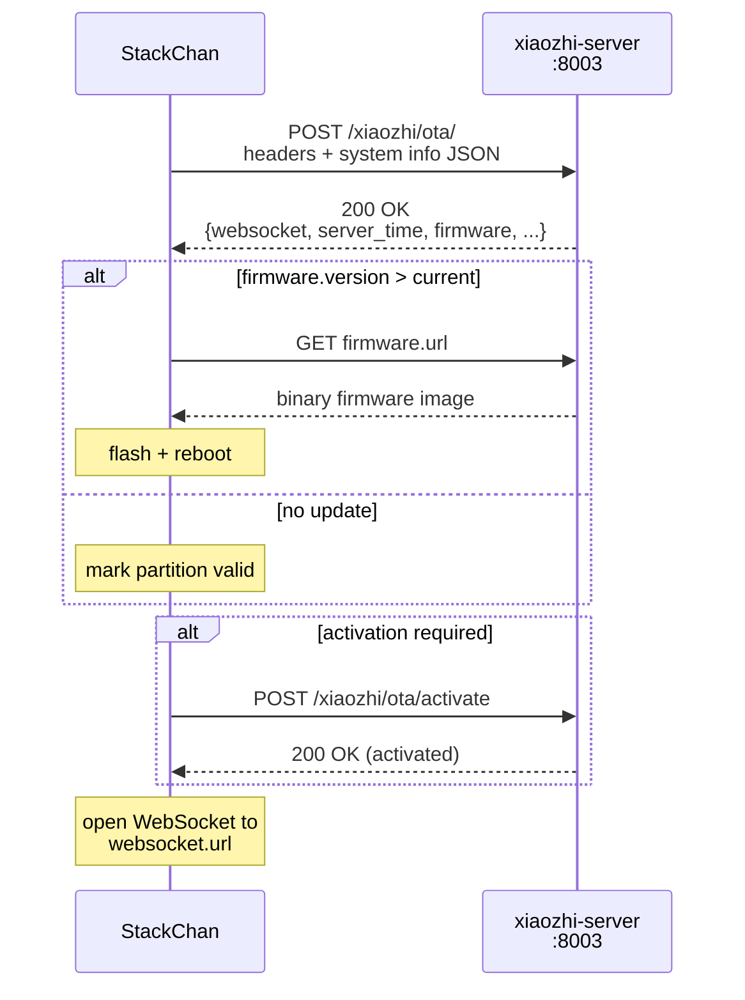

# OTA server verification

## TL;DR

- The StackChan firmware contacts `<XIAOZHI_PUBLIC_OTA_BASE_URL>/xiaozhi/ota/` on every boot.
- The OTA response delivers the **WebSocket URL** the device uses for voice — this is how the device discovers its server.
- The same endpoint optionally signals a **firmware update** (version + binary URL).
- The server also sends **server time**, allowing the device to sync its clock without NTP.
- No authentication on the OTA endpoint — anyone on the LAN can query it.

## Endpoint

```
POST <XIAOZHI_PUBLIC_OTA_BASE_URL>/xiaozhi/ota/
```

The URL is compiled into the firmware via `CONFIG_OTA_URL` in `sdkconfig.defaults`. The device can also override it at runtime through a Wi-Fi settings key (`ota_url`). If neither is set, the firmware falls back to the upstream default (`https://api.tenclass.net/xiaozhi/ota/`).

The container always listens on `8003`. `XIAOZHI_HTTP_PORT` controls the Compose host mapping, while `XIAOZHI_PUBLIC_OTA_BASE_URL` may point at that mapping or at an HTTP(S) gateway.

## What the firmware sends

### HTTP method

The firmware sends a **POST** if it has system info to report (which it always does on StackChan), otherwise a GET. In practice it is always POST.

### Headers

| Header | Value | Notes |
|---|---|---|
| `User-Agent` | `StackChan/<firmware_version>` | Board name + app version from `esp_app_get_description()`. Example: `StackChan/0.9.1` |
| `Content-Type` | `application/json` | Always set |
| `Device-Id` | `aa:bb:cc:dd:ee:ff` | Wi-Fi STA MAC address, lowercase hex colon-separated |
| `Client-Id` | UUID string | Board-generated UUID, persisted in NVS |
| `Activation-Version` | `1` or `2` | `2` if the device has a serial number burned into eFuse; `1` otherwise |
| `Accept-Language` | `en` | Language code from firmware build config (`Lang::CODE`) |
| `Serial-Number` | 32-char string | Only present if `Activation-Version: 2` (eFuse user data populated) |

### Request body

A JSON object containing full device inventory. Structure (from `Board::GetSystemInfoJson()`):

```json
{
  "version": 2,
  "language": "en",
  "flash_size": 16777216,
  "minimum_free_heap_size": "123456",
  "mac_address": "aa:bb:cc:dd:ee:ff",
  "uuid": "xxxxxxxx-xxxx-xxxx-xxxx-xxxxxxxxxxxx",
  "chip_model_name": "esp32s3",
  "chip_info": {
    "model": 9,
    "cores": 2,
    "revision": 2,
    "features": 18
  },
  "application": {
    "name": "xiaozhi",
    "version": "0.9.1",
    "compile_time": "2026-04-20T14:30:00Z",
    "idf_version": "v5.5.4",
    "elf_sha256": "abcdef0123456789..."
  },
  "partition_table": [
    {
      "label": "nvs",
      "type": 1,
      "subtype": 2,
      "address": 36864,
      "size": 24576
    }
  ],
  "ota": {
    "label": "ota_0"
  },
  "display": {
    "monochrome": false,
    "width": 320,
    "height": 240
  },
  "board": { }
}
```

!!! note "Field types"
    `minimum_free_heap_size` is encoded as a **string** (not a number) in the firmware's JSON builder. This is a quirk of the upstream code.

## What the server responds with

HTTP 200 with a JSON body. The firmware parses five optional top-level sections:

```json
{
  "activation": {
    "message": "Device registered",
    "code": "ABC123",
    "challenge": "...",
    "timeout_ms": 30000
  },
  "mqtt": {
    "endpoint": "...",
    "client_id": "...",
    "username": "...",
    "password": "..."
  },
  "websocket": {
    "url": "<XIAOZHI_PUBLIC_WS_BASE_URL>/xiaozhi/v1/",
    "token": "optional-auth-token"
  },
  "server_time": {
    "timestamp": 1745539200000,
    "timezone_offset": 600
  },
  "firmware": {
    "version": "1.0.0",
    "url": "<XIAOZHI_PUBLIC_OTA_BASE_URL>/xiaozhi/ota/download/stackchan.bin",
    "force": 0
  }
}
```

### Section-by-section breakdown

#### `websocket` (critical)

The device stores the `url` key into NVS settings and uses it to open its voice WebSocket connection. **Without this section, the device has no server to talk to.**

Our rendered `.config.yaml` appends `/xiaozhi/v1/` to `XIAOZHI_PUBLIC_WS_BASE_URL`, and xiaozhi-server includes the result in every OTA response.

#### `server_time`

- `timestamp` — milliseconds since Unix epoch.
- `timezone_offset` — offset from UTC in **minutes** (e.g. 600 for UTC+10).

The firmware calls `settimeofday()` using these values. This is the device's only clock-sync mechanism (no NTP client).

#### `firmware`

- `version` — semver string. The firmware compares this to its running version using dotted-integer comparison.
- `url` — full HTTP URL to the firmware binary. The device downloads it via `esp_https_ota`.
- `force` — if `1`, the device installs the firmware regardless of version comparison.

If `firmware` is absent or the version is not newer, the device marks its current partition as valid (cancels any pending rollback from a previous OTA) and proceeds to connect.

#### `activation`

Used for device registration flows. The firmware displays `code` on screen and polls `POST /xiaozhi/ota/activate` until the server confirms activation. If `challenge` is present (Activation-Version 2), the device computes an HMAC-SHA256 response using an eFuse-stored key.

**Our deployment does not use activation.** The xiaozhi-server returns an activation code for new devices, but since we have a single device on a private LAN, this is a one-time formality.

#### `mqtt`

Alternative to `websocket` — if the server returns `mqtt` config instead, the device uses MQTT as its transport protocol. **Our deployment uses WebSocket, not MQTT.** The firmware prefers MQTT if both are present.

## Boot sequence



The firmware retries the OTA check up to 10 times with exponential backoff (starting at 10 s, doubling each retry) before giving up.

> **Firmware updates over OTA are not set up in this project.** This deployment
> doesn't host firmware binaries, so the OTA response carries no `firmware`
> section — the endpoint is used purely for WebSocket discovery + clock sync.
> Flashing is done over USB-C (see the "Firmware iteration" section in
> `CLAUDE.md`). The schema above documents the protocol the firmware *can*
> parse, not a flow that's wired up here.

## Manual testing

### Check the OTA endpoint

```bash
# Minimal request — just GET the endpoint
curl -s <XIAOZHI_PUBLIC_OTA_BASE_URL>/xiaozhi/ota/

# Full POST mimicking the firmware
curl -s -X POST <XIAOZHI_PUBLIC_OTA_BASE_URL>/xiaozhi/ota/ \
  -H "Content-Type: application/json" \
  -H "Device-Id: aa:bb:cc:dd:ee:ff" \
  -H "Client-Id: test-client-001" \
  -H "User-Agent: StackChan/0.9.1" \
  -H "Activation-Version: 1" \
  -H "Accept-Language: en" \
  -d '{
    "version": 2,
    "language": "en",
    "flash_size": 16777216,
    "mac_address": "aa:bb:cc:dd:ee:ff",
    "chip_model_name": "esp32s3",
    "application": {
      "name": "xiaozhi",
      "version": "0.9.1"
    }
  }'
```

### Verify the WebSocket URL is returned

```bash
curl -s <XIAOZHI_PUBLIC_OTA_BASE_URL>/xiaozhi/ota/ | python3 -m json.tool
```

!!! warning "Unverified"
    The exact response format from the xiaozhi-esp32-server's OTA handler has not been captured from a live request. The schema above is derived from the firmware's parsing code (`ota.cc`). The server may return additional fields or omit optional sections. Run the curl commands above against your deployment to confirm the actual response shape.

### Check connectivity from the device's network

If the device fails to connect, verify basic reachability:

```bash
# From a machine on the same network as StackChan
curl -v <XIAOZHI_PUBLIC_OTA_BASE_URL>/xiaozhi/ota/
```

Common failure modes:

- **Connection refused** — xiaozhi-server, the published Compose port, or the public gateway is down.
- **Empty response / 404** — the container is running but the OTA route is not registered (possible image mismatch).
- **Timeout** — firewall rules or Docker network misconfiguration.

## Known limitations and gaps

!!! warning "Unverified sections"
    The following items have not been confirmed against a live capture. They are inferred from firmware source code and server configuration.

- **No authentication.** The OTA endpoint accepts requests from any client on the LAN. An attacker on the same network could query device info or, if they control the response, redirect the device to a malicious WebSocket server or firmware binary.

- **TLS depends on deployment.** Direct LAN deployments commonly use `http/ws`; a gateway deployment can advertise `https/wss` through the public base variables. The firmware must trust the gateway certificate chain.

- **Server-side OTA handler is opaque.** The xiaozhi-esp32-server's OTA handler is part of the upstream Python codebase (not our custom provider code). We have not audited what it returns beyond what the firmware parses. The response schema documented here is reconstructed from the client side.

- **Firmware binary hosting is not configured.** Our deployment does not currently host firmware binaries for OTA updates. The `firmware` section in the OTA response is presumably empty or absent. To enable OTA firmware updates, you would need to host the `.bin` file and configure the server to advertise it.

- **Clock sync depends on OTA.** The device's only clock source is `server_time` in the OTA response. If the OTA endpoint is unreachable, the device runs with an unset clock. This affects logging timestamps but has no known functional impact.

- **Activation flow is untested.** The HMAC-based Activation-Version 2 flow (eFuse serial number + challenge-response) is present in the firmware but has not been exercised in our deployment. The device likely receives a simple activation code on first connection and completes it automatically.

- **Protocol priority is MQTT-first.** If the server ever returns both `mqtt` and `websocket` sections, the firmware uses MQTT. This is unlikely with our config but worth noting in case of server misconfiguration.

## Source references

- Firmware OTA client: `firmware/xiaozhi-esp32/main/ota.cc` and `ota.h` (in the [xiaozhi-esp32](https://github.com/78/xiaozhi-esp32) repo)
- System info builder: `firmware/xiaozhi-esp32/main/boards/common/board.cc` — `Board::GetSystemInfoJson()`
- OTA URL config: `firmware/main/Kconfig.projbuild` — `CONFIG_OTA_URL` default
- StackChan sdkconfig: `firmware/firmware/sdkconfig.defaults` — `CONFIG_OTA_URL` override
- Server config: `.config.yaml` — internal `server.http_port` (8003), public `server.websocket`, and public `server.ota_base_url`
- ESP-IDF OTA API: [esp_https_ota.h](https://docs.espressif.com/projects/esp-idf/en/stable/esp32s3/api-reference/system/esp_https_ota.html)
- Upstream OTA spec reference (Chinese, Feishu doc): linked in `ota.cc` comment — `ccnphfhqs21z.feishu.cn/wiki/FjW6wZmisimNBBkov6OcmfvknVd`

## See also

- [architecture.md](./architecture.md) — where OTA fits in the boot-to-voice flow.
- [protocols.md](./protocols.md#xiaozhi-websocket) — the WebSocket session that follows OTA.
- [voice-pipeline.md](./voice-pipeline.md) — what runs on port 8000 after the device connects.
- [hardware.md](./hardware.md) — the StackChan device that initiates the OTA handshake.

Last verified: 2026-05-17.
