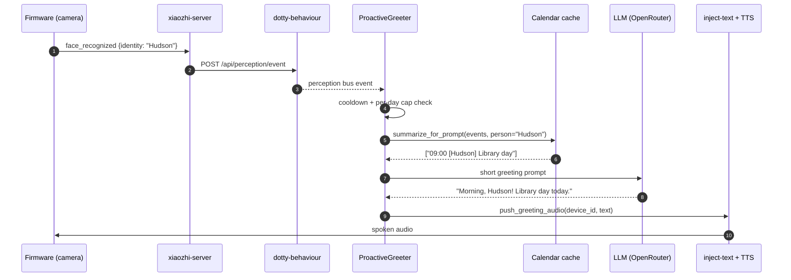

# Proactive Greetings (Layer 6)

> **Status:** code complete and deployed; bench-validation pending. Tracked in `tasks.md` under "Layer 6 proactive greetings" until a walk-through confirms greeting + cooldown across a bridge restart.

Layer 6 lets Dotty start a conversation. Instead of only responding to
voice input, the robot recognises a face, looks up that person in the
calendar, and pushes a short spoken greeting through the existing TTS
path.

A greeting fires for every recognised face subject to **cooldown** and
**per-day cap** only — there is no time-of-day gate. The current hour
is still used to phrase the greeting ("Good morning, Brett!" vs "Good
evening, …") but never to decide whether to speak.

This is the first server-initiated speech path in the project. Earlier
layers were strictly reactive (face detected → "Hi!"). Layer 6 turns
the same trigger into a context-aware utterance that can mention
today's library trip without the user asking first.

## Architecture



The greeter is a single subscriber on the perception bus. It runs
alongside the existing Phase 1.5 face-greeter and Phase 1.6 sound-turner
without conflict — those react to bare `face_detected` / `sound_event`,
while this one targets `face_recognized` (Layer 4 output).

## Trigger chain

1. **Layer 2 — face detection.** Firmware-side classifier emits
   `face_detected` perception events.
2. **Layer 4 — face recognition.** Identity classifier (in progress)
   promotes the detection to `face_recognized` with an
   `identity` field.
3. **Layer 6 — proactive greeter.** Subscribes to `face_recognized`
   (and optionally `face_detected` while Layer 4 is being wired —
   see `GREETER_USE_FACE_DETECTED`).
4. **Cooldown + per-day cap gate.** Per-person cooldown (default 4h)
   and per-day cap (default 1) — no time-of-day gating.
5. **Layer 5 — calendar context.** Person-filtered events for today
   via `summarize_for_prompt(events, person=name, include_household=True)`.
6. **LLM.** ≤15-word warm spoken greeting.
7. **Kid-safety sandwich.** Same surface as voice turns; the
   greeting is also constrained directly in the prompt.
8. **TTS push.** `push_greeting_audio()` → existing `inject-text`
   admin route → xiaozhi-server TTS → robot speaker.

## Configuration

| Env var | Default | Purpose |
|---|---|---|
| `GREETER_ENABLED` | `true` | Master kill switch. |
| `GREETER_USE_FACE_DETECTED` | `false` | Subscribe to `face_detected` as a fallback while Layer 4 isn't wired. Treats every detection as identity=`unknown`. |
| `GREETER_GREET_UNKNOWN` | `false` | When true, greet unrecognised faces with a generic "Hello! I don't think we've met." |
| `GREETER_COOLDOWN_HOURS` | `4` | Minimum hours between greetings for the same identity. |
| `GREETER_PER_DAY_MAX` | `3` | Hard cap on greetings per identity per day. The 4h cooldown already prevents back-to-back firings, so this is a safety ceiling rather than a politeness lever — turn it down if 3 greetings/day feels noisy. |
| `GREETER_STATE_PATH` | `/var/lib/dotty-behaviour/state/greeter_state.json` | Persistent greet log so a restart doesn't re-greet everyone. |
| `GREETER_GREETING_MAX_WORDS` | `15` | Word cap fed to the LLM prompt; the model is also told "one sentence". |

State file format (atomic write, JSON):

```json
{
  "2026-04-25": {
    "Hudson": { "count": 1, "last_ts": 1745540400.12 }
  }
}
```

A corrupt state file is logged and discarded — the greeter starts
fresh rather than crash. Days other than today are GC'd on every
write so the file stays bounded.

## Failure modes

The greeter is defence-in-depth wrapped: every external call (LLM,
calendar, TTS push, state I/O) is in a `try/except`. A greeter
failure must **never** break the voice path or the perception bus.

| Failure | Behaviour |
|---|---|
| LLM unreachable / raises | Falls back to `"Good {window}, {name}!"` template. |
| Calendar lookup raises | Continues without calendar context. |
| TTS push raises | Logged; no retry; next event will try again. |
| State file corrupt | Discarded, in-memory state starts empty. |
| State file write fails | Logged; the greet still happens. |
| Perception event malformed | Skipped silently. |

## Privacy

Layer 6 is a downstream consumer — it only ever sees the
**identity string** that Layer 4 emits. The biometric embedding,
photo, and any encryption-at-rest concerns are firmware-side
responsibilities (see Layer 4 docs when published).

The calendar funnel is the same chokepoint as voice turns
(`summarize_for_prompt`) so there are no new ISO timestamps, email
addresses, or raw calendar IDs leaking into a prompt. Person
filtering is on by default — when generating Hudson's greeting we
only fetch his events plus the household bucket.

## Server-push mechanism

Today the greeter pushes through the same `xiaozhi-server`
`inject-text` admin route the Layer 1.5 face-greeter uses. That
relies on the server-side TTS provider. The xiaozhi WS protocol
also supports server-pushed `tts/sentence_start`-style framing
directly (the dance audio path uses it), so a future optimisation
is to bypass the TTS provider for cached pre-rendered greetings.
The wrapper `bridge/server_push.push_greeting_audio()` exists to
keep that change scoped to a single function.

## Cross-references

- **Layer 4 — face recognition** (in progress) — emits the
  `face_recognized` events this module consumes.
- **Layer 5 — calendar** — see `summarize_for_prompt` in
  `bridge.py` for the privacy contract.
- **Kid Mode** — `docs/kid-mode.md` covers the safety surface that
  the greeter inherits.
- **Observability** — `docs/observability.md` covers the metrics
  surface; greeter-specific metrics are tracked under perception
  events for now.

## Files

- `bridge/proactive_greeter.py` — `ProactiveGreeter` class.
- `bridge/server_push.py` — `push_greeting_audio()` wrapper.
- `tests/test_proactive_greeter.py` — cooldown / per-day cap / unknown /
  template-fallback unit tests.
